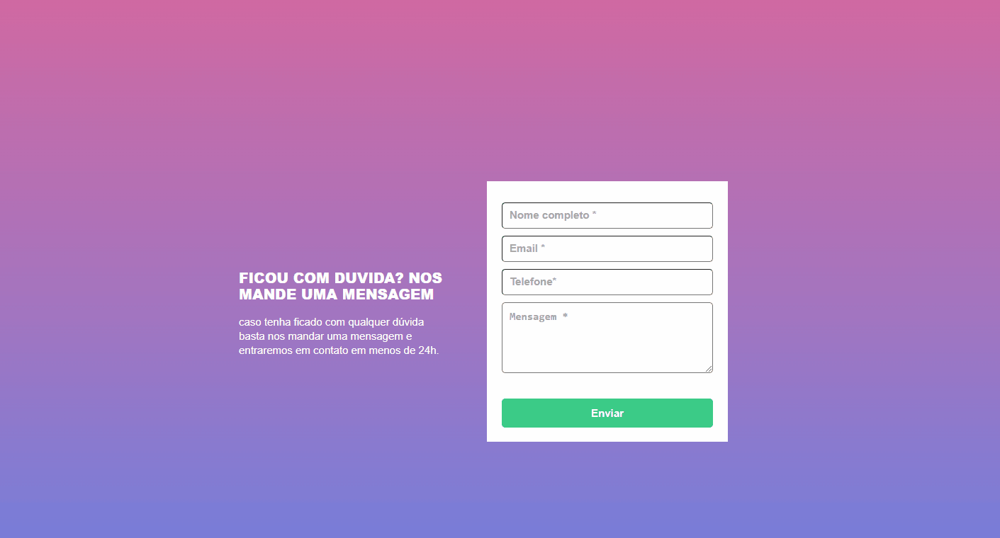
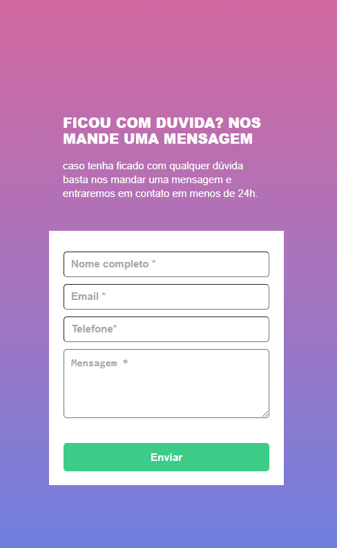

# Formulário com Validação
A validação foi feita com javascript puro, ao clicar para enviar o formulário, se caso algum campo não estiver preenchido, a borda do input fica vermelha e aparece uma mensagem "campo obrigatório". Se eu preencher o input e tirar o foco aparece a borda verde, sumindo a mensagem e podendo prosseguir para a próxima entrada

---

## Funcionalidade da validação
[]
---

## Modo desktop
[]

---

## Modo mobile
[]

---

## Como utilizar

1 - Clone pro o projeto
```
git clone https://github.com/rjunio98/formulario-com-validacao.git

```

2 - Acesse a pasta do projeto
```
cd formulario-com-validacao

```
---

## Tecnologias utilizadas
- HTML
- CSS
- JavaScript
- Git
- VSCode


